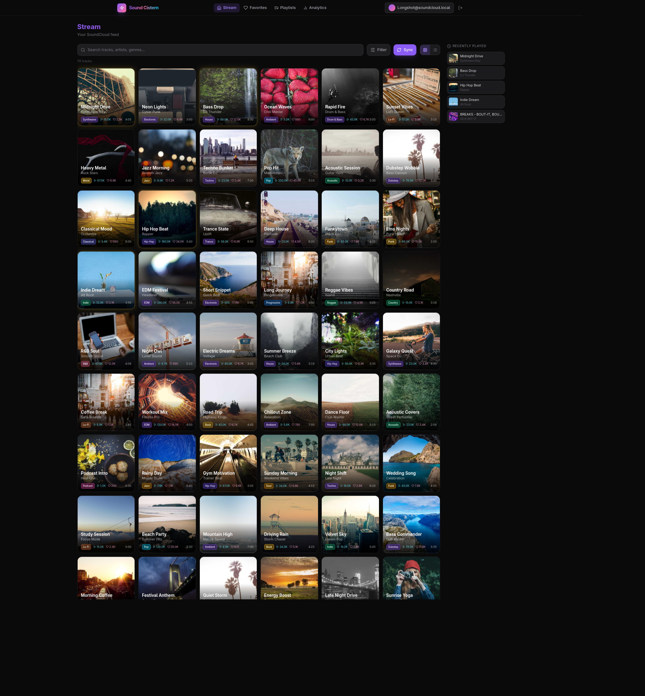

# Sound Cistern

[](https://github.com/jbhicks/sound-cistern/actions/workflows/test.yml)

A Go/PocketBase app for filtering and browsing SoundCloud feeds. Favorites, sort, search, genre and duration filters, HQ streams.



**Stack:** Go 1.24, PocketBase, Templ, HTMX, SQLite. Optional Vite UI in `v2/`.

## Run

Needs Go 1.24+ and the Templ CLI (`go install github.com/a-h/templ/cmd/templ@v0.3.960`).

```console
make dev
```

App: http://127.0.0.1:8090  
Admin: http://127.0.0.1:8090/_/

`make dev` runs in `TEST_MODE` (OAuth mocked). For a production-style serve: `make build && make serve`.

## Test

```console
make test              # unit tests
make test-all          # unit + integration
```

## License

MIT. See [LICENSE](LICENSE).
